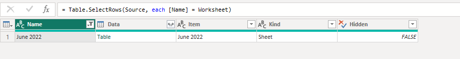
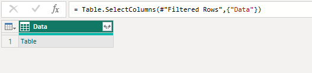
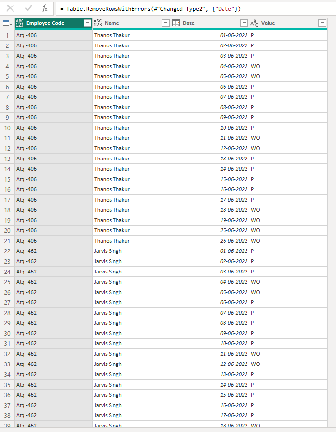
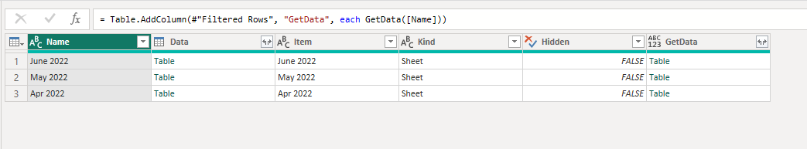
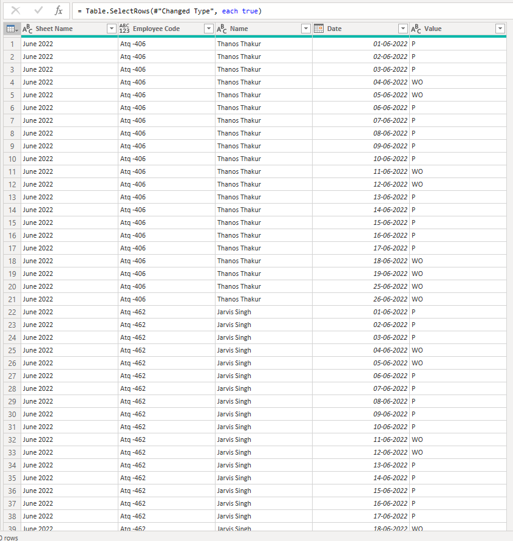

# CodeBook - Data Cleaning Steps

## Combining Data from Different Sheets in Excel

The first step of cleaning involves combining data from different sheets in an Excel workbook where each sheet contains different column names. 

### Reference:
[Power BI Combine Multiple Excel Worksheets](https://blog.crossjoin.co.uk/2018/07/09/power-bi-combine-multiple-excel-worksheets/)

### Steps:

#### **Step 1: Transform the Table in Power Query Editor**
- Load all worksheets from the Excel file into Power BI using **Power Query Editor**.
- Duplicate the table and name the duplicated table as **Template**.

#### **Step 2: Configure the Template Query**
- In the **Template** query, select one worksheet to use as a reference to build the query. In this case, we use the worksheet **June 2022**.
  
- Remove all the columns except for the **Data** column.
  
- Click the **Table** link inside the **Data** cell to view the worksheet contents.
- If there is a **Changed Type** step in the query, delete it because it might not be required for the new transformation.

#### **Step 3: Clean the Data**
- **Promote Headers**: Promote the first row of the table to be the column headers.
- **Remove Top Rows**: Remove unnecessary top rows if needed.
- **Rename Columns**: Rename columns as follows:
  - **Column2** to **Name**
  - **Atliq** to **Employee Code**
  
- **Unpivot Columns**: Unpivot all other columns except **Name** and **Employee Code**.
  
- **Change Data Type**: Change the **Date** column data type to **Date** and remove any errors that occur in the data.

#### **Step 4: Create a Parameter**
- Create a new **parameter** by navigating to **Manage Parameters** > **New Parameter**.
- Call the parameter **Worksheet**, set the data type to **Text**, and set it to return the name of the worksheet you chose (e.g., **June 2022**).
  

#### **Step 5: Modify Template Query**
- Go back to the **Template** query and locate the step called **Filtered Rows**, where you filtered to a single worksheet. 
- Click the gear icon next to the **Filtered Rows** step to edit the filter condition. The filter should be based on the new parameter (e.g., **Worksheet**).
  

#### **Step 6: Create a Function**
- In the **Queries** pane on the left-hand side of Power Query Editor, right-click on the **Template** query and select **Create Function**.
- Give the new function the name **GetData**.

#### **Step 7: Filter and Invoke Custom Function**
- Go back to the original table and apply a filter to select only the data for **June 2022**, **May 2022**, and **Apr 2022**.
- Next, go to the **Add Column** tab in Power Query Editor, click the **Invoke Custom Function** button, and invoke the **GetData** function. Pass in the contents of the **Name** column as the only parameter to the function.
  

#### **Step 8: Expand and Aggregate Data**
- After invoking the custom function, click the **Expand** button on the new column to expand the nested tables.
- Remove any unnecessary columns from the expanded data and ensure you have combined the data from all the worksheets into a single table as needed.
  
   
  

### Summary of Data Cleaning Steps:
1. Combine data from different sheets with different column names.
2. Clean and transform the data using Power Query Editor:
   - Promote headers, remove unnecessary columns, unpivot data, change data types.
3. Create a parameter for worksheet names.
4. Create a function to standardize the data combination process.
5. Filter, invoke the custom function, and expand the data into a consolidated table.

---

### Notes:
- Screenshots were included throughout the steps to illustrate the process.
- Ensure that all columns are renamed correctly and that the data is cleaned appropriately for analysis.
