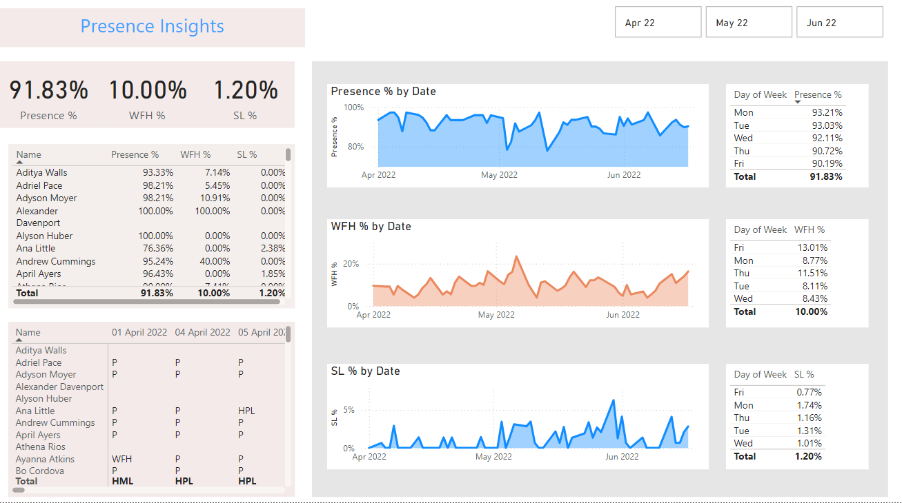

# Employee Attendance Insights
This project analyzes employee attendance patterns, work-from-home (WFH) trends, and sick leave data to provide HR teams with insights to optimize workforce planning, improve attendance tracking, and make data-driven decisions.
## Installation Instructions
1. Download and install [Power BI Desktop](https://powerbi.microsoft.com/desktop/).
2. Clone or download this repository.
3. Open the `.pbix` Power BI project file in Power BI Desktop.
4. Link the provided `Attendance Sheet 2022-2023_Masked.xlsx` file in Power BI using Power Query Editor.
5. Refresh the data to load the latest updates.

## Usage
1. Open the Power BI project file (`Employee_Attendance_Insights.pbix`).
2. Use the slicers on the dashboard to filter the data .
3. Explore visualizations like attendance trends, WFH patterns, and sick leave behavior.

## Dashboard Screenshot

## Acknowledgments
- Thanks to [Power BI](https://powerbi.microsoft.com/) for providing powerful visualization capabilities.
- Special thanks to the HR team for their valuable data and feedback.

--------------------------------------------------------------------------------------------------------------
- This repository contains the documentation for cleaning and analyzing the Employee Attendance Sheet data.
- For full details on the data cleaning process, please refer to the CodeBook.md.
